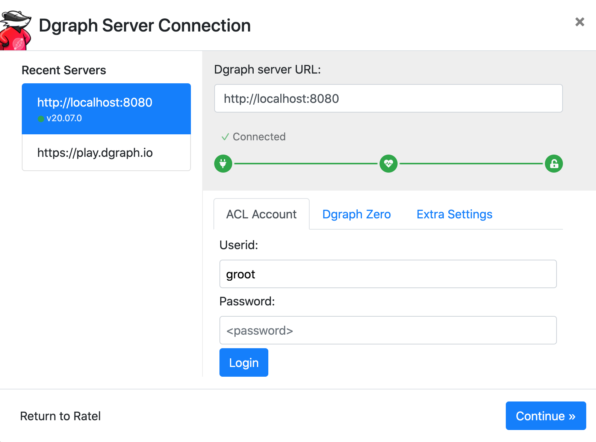

<!-- TODO Plugin logo <p align="center">
    
</p> -->
<br/>
<p align="center">
    <a href="https://github.com/fasten-project/fasten/actions" alt="GitHub Workflow Status">
        </a>
    <!-- Here should be a link to Maven repo and version should be pulled from there. -->
    <a href="https://github.com/fasten-project/fasten/" alt="GitHub Workflow Status">
                </a>
</p>
<br/>

<!-- TODO Introduction: The FASTEN TODO Plugin is a ... -->

## Arguments
<!-- TODO - `-h` `--help` Show this help message and exit. -->
- `-f` `--file` Path to the dummy JSON Kafka topic file containing the repo URL
<!-- FIXME - `-d` `--database` Database URL -->
<!-- FIXME - `-u` `--user` Database username -->

## Usage 

#### <!-- TODO ultimate goal -->
1. Start the plugin:
    ```bash
    mvn clean install exec:java -Dexec.args="--file dummyKafkaTopic.json"
    ```
   This demo simulates a Kafka topic consumption by reading the [`dummyKafkaTopic.json` file](dummyKafkaTopic.json).\
   Upon topic consumption, the `compliance-analyzer` launches Quartermaster that will build the specified repository. 

1. Wait for the building process to be over:
    ```bash
    kubectl logs --follow $(kubectl get pods --selector job-name=qmstr -o=name) qmstr-client
    ```

1. Forward two local ports to the following two ports on the DGraph Pod:
    ```bash
    kubectl port-forward $(kubectl get pods --selector job-name=qmstr -o=name) 8000:8000
    ```
    ```bash
    kubectl port-forward $(kubectl get pods --selector job-name=qmstr -o=name) 8080:8080
    ```

1. Open [localhost:8000/?latest](http://localhost:8000/?latest) in your browser.

1. Click on "Continue":
    <p align="center">
        
    </p>

1. Navigate to the "Console" page
    <!-- TODO -->
    <!-- <p align="center">
        
    </p> -->

1. You should now be able to query the database
    <!-- TODO -->
    <!-- ```graphql
    {
        ...
    }
    ``` -->

## Join the community

The FASTEN software package management efficiency relies on an open community contributing to open technologies. Related research projects, R&D engineers, early users and open source contributors are welcome to join the [FASTEN community](https://www.fasten-project.eu/view/Main/Community), to try the tools, to participate in physical and remote worshops and to share our efforts using the project [community page](https://www.fasten-project.eu/view/Main/Community) and the social media buttons below.  
<p>
    <a href="http://www.twitter.com/FastenProject" alt="Fasten Twitter">
        </a>
    <a href="http://www.slideshare.net/FastenProject" alt="GitHub Workflow Status">
                </a>
    <a href="http://www.linkedin.com/groups?gid=12172959" alt="Gitter">
            </a>
</p>
