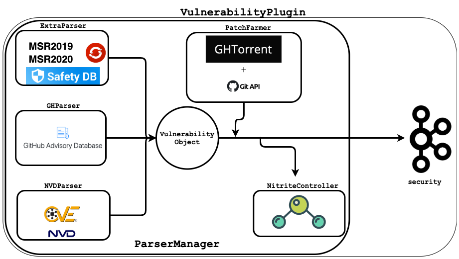

# Security Plugin
The following documentation aims to offer an overview of the implementation of the **Security** Plugin. Looking at the bigger picture, the goal of this plugin is to gather information related to vulnerabilities in order to enrich the Knowledge Base at the callable-level detail. In a perfect scenario, for each vulnerability the plugin would point to the specific callable that was responsible for the security flaw.

## Architecture


### Parsers
The `ParserManager` class contains and handles data inputs from all different parsers implemented. Every Parser Object (`NVDParser`, `GHParser`, `ExtraParser` and `OVALParser`) pulls information from (a) differente source(s) and is also capable of retrieving updates from the same source(s). Each Object implements the following Interface:

```java
public interface VulnerabilityParser {
    // Method to retrieve existing vulnerabilities
    HashMap<String, Vulnerability> getVulnerabilities();

    // Method to retrieve updated and new vulnerabilities
    HashMap<String, Vulnerability> getUpdates();
}
```
The `ParserManager` first calls `getVulnerabilities` from each Parser and then aggregates all the information in a commmon format that is passed down the pipeline for more data enrichment. The other method implemented by each Parser is `getUpdates`, which will be called daily in order to aggregate new information from each source. This makes the process of adding new Parsers from new sources of information easier.

### Patches
In order to find where specifically the vulnerability lies in a package, `patch` links allow to retrieve information regarding _what was changed in order to patch the vulnerability_. Combined with some heuristics, this allows to drill down the specific `callables` that were patched.

The `PatchFarmer` receives a list of references contained in each Vulnerability Object and handles each of them in order to figure out if it's possible to extract some **patch diffs**. The following is a list of the sources of information handled by the class:

- GitHub Commits ([example](https://github.com/python/cpython/commit/fbf648ebba32bbc5aa571a4b09e2062a65fd2492))
- GitHub Pull Requests ([example](https://github.com/omniauth/omniauth-oauth2/pull/25))
- GitHub Issues ([example](https://github.com/neo4j-contrib/neo4j-apoc-procedures/issues/931))
- Bugzilla<sup>*</sup> ([example](https://bugzilla.mozilla.org/show_bug.cgi?id=1615315))
- JIRA tickets<sup>*</sup> ([example](https://issues.apache.org/jira/browse/ZOOKEEPER-1045))
- Git Trackers<sup>*</sup> ([example](https://git.kernel.org/pub/scm/git/git.git/diff/?id=3ec804490a265f4c418a321428c12f3f18b7eff5))

<sup>*</sup> _supported in future versions_ 

Patches from GitHub make up 90% of all references and in order to extract information, two different sources are used.
The first one is ([GHTorrent](https://ghtorrent.org/)), running on TU Delft servers that offers a queriable offline mirror of the data offered through the GitHub REST API. Whenever an instance is not found in GHTorrent, the Github REST API is used directly.

### Nitrite

In order to store results along the way ([Nitrite](https://github.com/nitrite/nitrite-java)) is used, which offers MongoDB like API and supports in-memory and single file based persistent store. All the logic is handled by the `NitriteController` class and the structure of the small DB instance is simple. Two `Object Repositories` are created, one storing `PatchObject` instances and the other `VulnerabilityObject` instances. Both classes are indexed based on a unique id, which is represented by a reference (for patches) and by an id (for vulnerabilities) and makes retrieval faster.

The purpose of using Nitrite is two-fold. On one hand, it offers the ability to store the enriched output of the pipeline, making it resilient to failure. At the same time, it allows to be more efficient by checking which references have already been parsed for patches and which vulnerabilities have already been processed and outputted. This is an essential and necessary check the needs to be performed since not all sources of information offer a way to retrieve updates.

### Threads
The `VulnerabilityPlugin` class handles the output of the `ParserManager` and produces to a Kafka topic named `security`. The logic is encapsulated into two threads. The first one is the `ProducerThread` that takes care of parsing the first dump of information from all sources. Once the heavy lifting is done, a new thread is started, the `UpdaterThread` that runs forever, retrieving updates **once per day**. 
The frequency of updates differs for each source of information as specified later.

```java
while (true) {
    sleep()
    queue.addAll(parserManager.getUpdates())
}
```

Another plugin will be implemented consuming information from the `security` topic with the goal to inject the information coming from the `VulnerabilityPlugin` into FASTEN Knowledge Base.

## Vulnerability Object Definition
In order to merge all the different sources together, a common difinition of vulnerability has been introduced. Here is a JSON representation of an example from the famous HearthBleed (CVE-2014-0160):

```json
{
    "id": "CVE-2014-0160",
    "description" : "The (1) TLS and (2) DTLS implementations in OpenSSL 1.0.1 before 1.0.1g do not  properly handle Heartbeat Extension packets, which allows remote attackers to obtain sensitive information from process memory via crafted packets that trigger a buffer over-read, as demonstrated by reading private keys, related to d1_both.c and t1_lib.c, aka the Heartbleed bug.",
    "severity": "HIGH",
    "scoreCVSS2": 5.0,
    "scoreCVSS3": 7.5,
    "published_date": "07/04/2014",
    "last_modified_date": "09/10/2019",
    "vulnerable_purls": [
                            "pkg:generic/openssl@1.0.1",
                            "pkg:generic/openssl@1.0.1a",
                            "pkg:generic/openssl@1.0.1b",
                            "pkg:generic/openssl@1.0.1c",
                            "pkg:generic/openssl@1.0.1d",
                            "pkg:generic/openssl@1.0.1e",
                            "pkg:generic/openssl@1.0.1f"
                        ],
    "references":       [
                            "http://advisories.mageia.org/MGASA-2014-0165.html",
                            "http://blog.fox-it.com/2014/04/08/openssl-heartbleed-bug-live-blog/",
                            "http://cogentdatahub.com/ReleaseNotes.html",
                            "...",
                        ],
    "patches":          [
                            "http://git.openssl.org/gitweb/?p=openssl.git;a=commit;h=96db9023b881d7cd9f379b0c154650d6c108e9a3"
                        ],
    "exploits":            [
                            "http://www.exploit-db.com/exploits/32764",
                            "http://www.exploit-db.com/exploits/32745",
                            "...",
                        ],
    "changed_files":    [
                            {
                                "filename": "ssl/d1_both.c",
                                "date": "07/04/2014",
                                "line_numbers" : [
                                    1459,
                                    1489
                                ]
                            },
                            {
                                "filename": "ssl/t1_lib.c",
                                "date": "07/04/2014",
                                "line_numbers" : [
                                    2588
                                ]
                            }
                        ]
}
```
### Description of fields:
**id**: Identifies the vulnerability (e.g. `CVE-2014-0160`, `GHSA-3pc2-fm7p-q2vg`, `pyup.io-34978`)

**description**: Textual description of the vulnerability

**severity**: One of the following: `LOW, MEDIUM, MODERATE, HIGH, CRITICAL`

**scoreCVSS2**: Find more information [here](https://nvd.nist.gov/vuln-metrics/cvss/v2-calculator)

**scoreCVSS3**: Find more information [here](https://nvd.nist.gov/vuln-metrics/cvss/v3-calculator)

**published_date**: Date when the vulnerability was published

**last_modified_date**: Date when the vulnerability has been last modified

**vulnerable_purls**: Package coordinates of vulnerable packages. Follows [purl-spec](https://github.com/package-url/purl-spec) guidelines

**references**: List of links to pages and documentation

**patches**: List of links to patches that **fixed** the vulnerability

**exploits**: List of links to exploits. Most of them from [exploit-db](https://www.exploit-db.com/)

**changed_files**: List of changed files gathered from the patches. It allows to find which callable was causing the problem.


## Sources of information

The `ParserManager` aggregates information from the following sources of information:

Source       | License       | Frequency of updates
------------ | ------------- | ---------------------
[NVD JSON Feed](https://nvd.nist.gov/vuln/data-feeds#JSON_FEED) | Public Domain | Every 2 hours
[GitHub Advisories](https://github.com/advisories) | Public Domain | Daily
[MSR 2019<sup>1</sup>](https://github.com/SAP/project-kb/tree/master/MSR2019) | Public Domain | n/a
[MSR 2020<sup>2</sup>](https://github.com/ZeoVan/MSR_20_Code_vulnerability_CSV_Dataset) | Public Domain | n/a
[Safety DB](https://github.com/pyupio/safety-db) (by pyup.io) | [CC BY-NC-SA 4.0](https://creativecommons.org/licenses/by-nc-sa/4.0/) | Monthly
[cvedb](https://github.com/fabric8-analytics/cvedb) (by [fabric8-analytics](https://github.com/fabric8-analytics)) | n/a | Daily
[victims-cve-db](https://github.com/victims/victims-cve-db) | [CC BY-SA 4.0](https://github.com/victims/victims-cve-db/blob/master/cc-by-sa-4.0.txt) | n/a
[Debian Security Tracker<sup>*</sup> ](https://salsa.debian.org/security-tracker-team/security-tracker/-/blob/master/data/CVE/list) | Public Domain | Daily
[RustSec<sup>*</sup> ](https://github.com/RustSec/advisory-db) | Public Domain | Daily

<sup>*</sup> _supported in future versions_ 

### References
<sup>1</sup> Ponta, S. E., Plate, H., Sabetta, A., Bezzi, M., &amp; Dangremont, C. (2019). A Manually-Curated Dataset of Fixes to Vulnerabilities of Open-Source Software. 2019 IEEE/ACM 16th International Conference on Mining Software Repositories (MSR). doi:10.1109/msr.2019.00064

<sup>2</sup> Jiahao Fan, Yi Li, Shaohua Wang and Tien N. Nguyen. 2020. A C/C++ Code Vulnerability Dataset with Code Changes and CVE Summaries. In MSR ’20: The 17th International Conference on Mining Software Repositories,May 25–26, 2020, MSR, Seoul, South Korea. ACM, New York, NY, USA, 5 pages. https://doi.org/10.1145/3379597.3387501